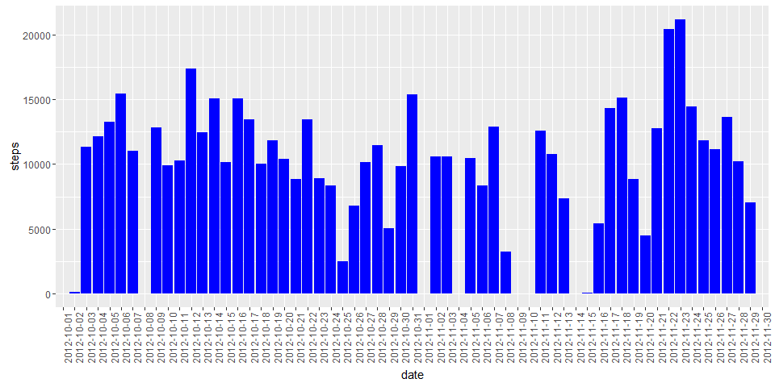
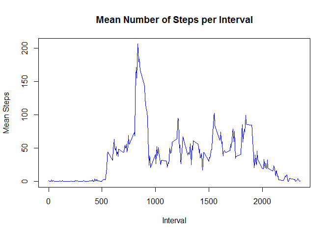

# Reproducible Research: Peer Assessment 1


## Loading and preprocessing the data
The data were downloaded with the GitHub Repository in the activity.zip file.  The data need to be unzipped to create the activity.csv file.  The activity.csv file is read into dataframe.  The csv file is delimited with commas and includes a header for naming the columns.


```r
unzip("activity.zip")
activity <- read.csv("activity.csv", header=TRUE, sep=",")
summary(activity)
```

```
##      steps                date          interval     
##  Min.   :  0.00   2012-10-01:  288   Min.   :   0.0  
##  1st Qu.:  0.00   2012-10-02:  288   1st Qu.: 588.8  
##  Median :  0.00   2012-10-03:  288   Median :1177.5  
##  Mean   : 37.38   2012-10-04:  288   Mean   :1177.5  
##  3rd Qu.: 12.00   2012-10-05:  288   3rd Qu.:1766.2  
##  Max.   :806.00   2012-10-06:  288   Max.   :2355.0  
##  NA's   :2304     (Other)   :15840
```


## What is mean total number of steps taken per day?
Below is a histogram of the total number of steps per day:

```r
library(ggplot2)
g <- ggplot(data = activity, aes(date, steps))
g <- g + stat_summary(fun.y = sum, na.rm=TRUE, geom = "bar", fill = "blue")
g <- g + theme(axis.text.x = element_text(angle = 90, hjust = 1))
print(g)
```

<!-- -->

The mean and median total number of steps per day is calculated in two steps:

1.  Create a dataframe with the total number of steps for each day
2.  Take the mean/median  of the total number of steps in the dataframe.

It should be noted that the data includes NAs, so the data need to be processed such that the NAs are removed.


```r
date_totals <- aggregate(activity$steps, by = list(activity$date), FUN=sum, na.rm=TRUE)
names(date_totals) <- c("date", "total_steps")
```

The mean total number of steps per day is 9354.2295082.  The median total number of steps per day 10395.

## What is the average daily activity pattern?
The average daily activity pattern is determined by taking the mean steps taken per interval. We use this output to plot a timeline of mean number of steps per interval.


```r
interval_mean <- aggregate(activity$steps, by=list(activity$interval), FUN=mean, na.rm=TRUE)
plot(interval_mean, type="l", xlab="Interval", ylab="Mean Steps", main="Mean Number of Steps per Interval", col="blue")
```

<!-- -->

```r
names(interval_mean) <- c("interval", "mean_steps")
```

The interval with the maximum number of steps on average is 835.

## Imputing missing values
There are 2304 rows in the data set where the number of steps is set to NA.  There are also 8 days that have a total number of steps equal to 0.  We will create a new data set with imputed values.  We will do this with these steps:

1.  Copy the dataframe into a new dataframe
2.  Impute the values for the missing intervals using the interval means calculated in the previous step.  This should replace all of the NAs with mean values.  The plot of the histogram for the days should no longer have any missing days.

We start with imputing the interval values.


```r
activity_no_NAs <- activity
for (i in 1:nrow(activity_no_NAs)) {
        if (is.na(activity_no_NAs$steps[i])) {
                interval_val <- which(interval_mean$interval == activity$interval[i])
                activity_no_NAs$steps[i] <- interval_mean$mean_steps[interval_val]
                #print(activity_no_NAs$steps[i])
        }
}
```

The number of remaining intervals with NAs after this processing step is 0.  

Below is a histogram of the total number of steps per day of the new data set:

```r
library(ggplot2)
g <- ggplot(data = activity_no_NAs, aes(date, steps))
g <- g + stat_summary(fun.y = sum, na.rm=TRUE, geom = "bar", fill = "blue")
g <- g + theme(axis.text.x = element_text(angle = 90, hjust = 1))
print(g)
```

<!-- -->


```r
date_totals_no_NAs <- aggregate(activity_no_NAs$steps, by = list(activity_no_NAs$date), FUN=sum, na.rm=TRUE)
names(date_totals_no_NAs) <- c("date", "total_steps")
```

The mean total number of steps per day is 1.0766189\times 10^{4}.  This mean is 1411.959171 different from the previous mean.  

The median total number of steps per day 1.0766189\times 10^{4}.  The median is 371.1886792 different from the previous median.


## Are there differences in activity patterns between weekdays and weekends?
The data need to be grouped by weekdays and weekends.  To do this, we first convert the date from a character to a date value.  As a date, we can then use the weekdays function to convert the dates to values such as Monday, Tuesday.  These values are then turned to 0s for weekend days and 1s for weekday days.  Finally, factor variable that represent these 0/1 as weekend/weekday is added to the data frame.

```r
activity_no_NAs$date <- as.Date(activity_no_NAs$date)
activity_no_NAs <- cbind(activity_no_NAs, weekdays(activity_no_NAs$date))
names(activity_no_NAs)[4] <- "weekday"
activity_no_NAs$weekday <- ifelse(activity_no_NAs$weekday == "Saturday" | activity_no_NAs$weekday == "Sunday", 0, 1)
weekday.f <- factor(activity_no_NAs$weekday, labels=c("weekend", "weekday"))
activity_no_NAs <- cbind(activity_no_NAs, weekday.f)
```

The data frame is subset into two different data frames: one for weekends and one for weekdays.  The mean of the intervals are then calculated for the two subsets.


```r
act_weekday <- subset(activity_no_NAs, subset = activity_no_NAs$weekday.f == "weekday")
act_weekend <- subset(activity_no_NAs, subset = activity_no_NAs$weekday.f == "weekend")

interval_weekday <- aggregate(act_weekday$steps, by=list(act_weekday$interval), FUN=mean)
interval_weekend <- aggregate(act_weekend$steps, by=list(act_weekend$interval), FUN=mean)
```

The interval means for both weekdays and weekends are plotted.


```r
ylim_val <- max(max(interval_weekend$x), max(interval_weekday$x))
par(mfrow=c(2,1))
plot(interval_weekday, type="l", xlab="Interval", ylab="Mean Steps", main="Mean Number of Steps per Interval for Weekdays", col="blue", ylim=c(0, ylim_val))
plot(interval_weekend, type="l", xlab="Interval", ylab="Mean Steps", main="Mean Number of Steps per Interval for Weekends", col="blue", ylim=c(0, ylim_val))
```

<!-- -->

The data show that the activity starts later in the day on weekends and the mean activity on the weekends is consistently higher on the weekends than the weekdays.
